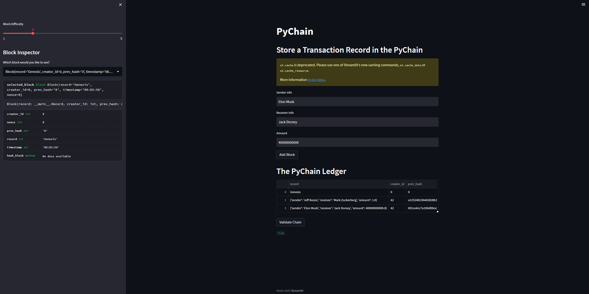
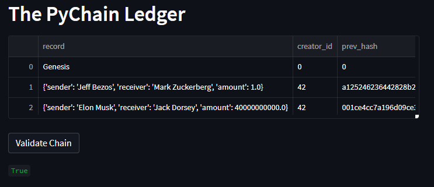
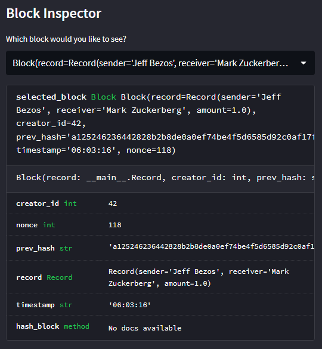

# PyChain Ledger

You can use the `PyChain` ledger and user interface by running your Streamlit application and storing some mined blocks in your `PyChain` ledger. Then test the blockchain validation process by using your `PyChain` ledger. To do so, complete the following steps:

1. In the terminal, navigate to the project folder where you've coded this assignment.

2. In the terminal, run the Streamlit application by using `streamlit run pychain.py`.

3. Enter values for the sender, receiver, and amount, and then click the Add Block button. Do this several times to store several blocks in the ledger.

4. To verify the blocks, click `Validate Chain`.

5. To inspect the blocks more closely, use the side panel and selected needed blocks from the dropdown.

